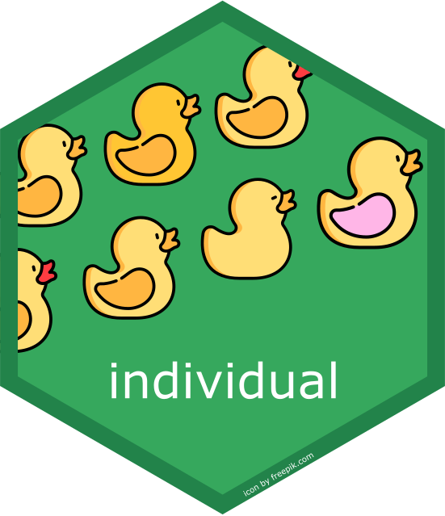

# Individual 

<!-- badges: start -->
[](https://github.com/mrc-ide/individual/actions)
[](https://codecov.io/github/mrc-ide/individual)
[](https://cran.r-project.org/package=individual)
[](https://opensource.org/licenses/MIT)
<!-- badges: end -->

An R package for specifying and simulating individual based models.

This package is designed to:

  1. encourage clear and testable components for defining your individual based 
models, and
  2. provide memory efficient, fast code for executing your model

## Installation

The package can be installed from github using the "remotes" library

```R
library('remotes')
install_github('mrc-ide/individual')
```

For development it is most convenient to run the code from source. You can
install the dependencies in RStudio by opening the project and selecting "Build" > "Install and Restart"

Command line users can execute:

```R
library('remotes')
install_deps('.', dependencies = TRUE)
```

Docker users can build a minimal image with

```bash
docker build . -f docker/Dockerfile -t [your image name]
```

Or if you would like devtools and documentation tools you can run

```bash
docker build . -f docker/Dockerfile.dev -t [your image name]
```

## Usage

We recommend first reading `vignette("Tutorial")` which describes
how to simulate a simple SIR model in "individual", and later `vignette("API")`
which describes in detail how to use the data structures in "individual" to
build more complicated models. If you are running into performance issues,
learn more about how to speed up your model in `vignette("Performance")`.

## Contributing

Thank you! Please refer to the vignette on `vignette("Contributing")` for info on how to
contribute :)

## Alternatives

### Non R Software

 - Repast
 - Mesa
 - NetLogo
 - Agents.jl

### Non R Software for Epi

 - EpiFire
 - SimpactCyan
 - Numerus Model Builder
 - NOVA
 - EMOD
 - Pathogen.jl, a package for individual based simulation of common compartmental models.

### General R Packages

 - nlrx, RNetLogo, NetLogoR are NetLogo interfaces
 - RRepast is a repast interface
 - simecol, provides classes and methods to enhance reproducibility of ecological models.

### R based DES

 - simmeR
 - SpaDES

### R based IBMs

 - IBMPopSim
 - ibm
 - ibmcraftr

### R based Epi

 - EpiModel 
 - SimInf
 - hybridModels
 - epinet
 - EpiDynamics
 - nosoi, generate synthetic data for phylogenetic analysis
 - EpiILMCT
 - EpiILM
 - SPARSEMODr
