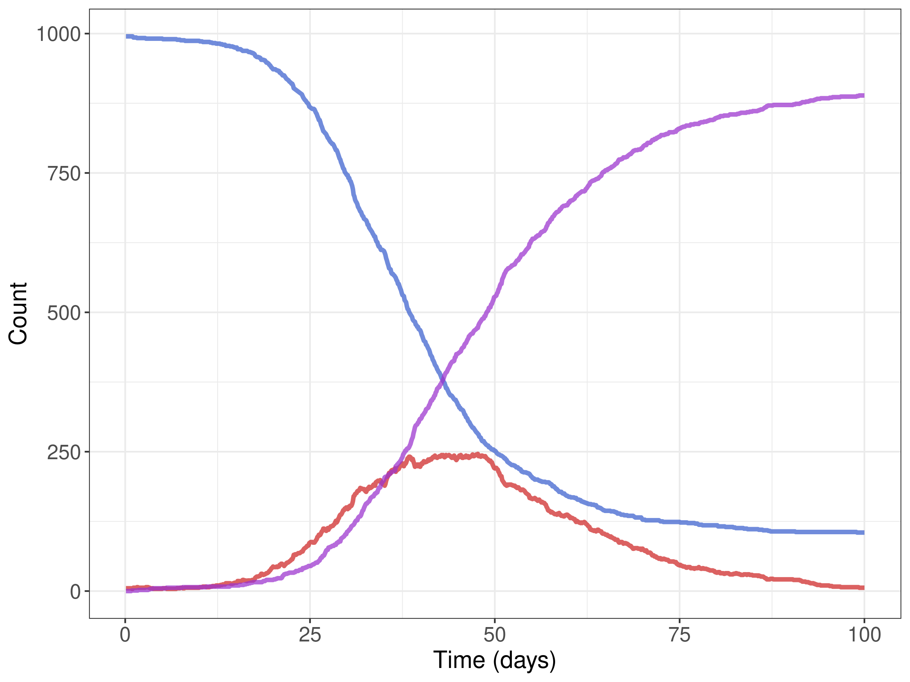

# Summary

Complex stochastic models are a crucial tool for many tasks 
in public health, and especially in infectious disease epidemiology [@Ganyani:2021]. 
Such models can formalize theory, generate synthetic data, evaluate counterfactual 
scenarios, forecast trends, and be used for statistical inference. Individual-based
models (IBMs) are a way to design disaggregated simulation models, usually contrasted
with mathematical or equation-based models, which may model a density or concentration
of individuals, or otherwise lump individuals with similar attributes together in some
way [@Shalizi:2006]. For modeling finite numbers of individuals with significant between-individual
heterogeneity in characteristics, which both within and between individual dynamics
could depend on in potentially complex ways, IBMs are a natural modeling
choice whereas a representation using mathematical models (especially compartmental models) would be cumbersome
or impossible [@Willem:2017]. Even if an aggregated representation were feasible, there are many 
reasons why an individual-based representation is to be preferred. Synthetic data
may need to produce individual level outcomes, which aggregated models by their very 
nature are unable to provide [@Tracy:2018]. Other complexities, such as when events occur after
a random delay whose distribution differs from a Markovian
one, mean even aggregated models will need to store individual completion times,
necessitating more complex simulation algorithms and data structures; in such
cases it is often more straightforward to adopt an individual-based representation
from the start.

`individual` is an R package which provides users a set of useful primitive elements
for specifying individual based simulation models, with special attention models
for infectious disease epidemiology. 
Users build models by specifying variables for each characteristic of individuals 
in the simulated population by using data structures exposed by the package.
The package provides efficient methods for finding
subsets of individuals based on these variables, or cohorts. Cohorts can then
be targeted for variable updates or scheduled for events.
Variable updates queued during a time step are executed at the end of a discrete time step,
and the code places no restrictions on how individuals are allowed to interact.
These data structures are designed to provide an intuitive way for users to turn their conceptual
model of a system into executable code, which is fast and memory efficient.

# Statement of need

In many applications, but especially epidemiology, individual-based models 
need to balance comprehensibility and speed. A fast model whose code is only
understood by the author can be difficult to use as a basis for scientific
exploration, which necessitates the development of various similar models to
test different hypotheses or explore sensitivity to certain assumptions. On the
other hand a clear yet slow model can be practically unusable for tasks such as
uncertainty quantification or statistical inference on model parameters. `individual`
provides a toolkit for epidemiologists to write models that is general enough
to cover nearly all models of practical interest using simple, standardized code which is
fast enough to be useful for computation heavy applications.

Based on our review of existing software below, no other library exists in
the R language which provides users with a set of primitive elements for defining 
epidemiological models without making strong restrictions upon the type of model 
being simulated (e.g.; compartmental, network, etc.), or limiting users to particular
mathematical forms for transition probabilities.

# Design Principles

The `individual` package is written in the R language, which is a *lingua franca*
in epidemiology. The package uses `Rcpp` [@Rcpp] to link to C++ source code, 
which underlies the data structures exposed to the user. 
The API for `individual` uses `R6` [@R6] classes at the R level
which users call to create, update, and query variables.

Because in many epidemiological models the most important part of an individual's state
can be represented as mutually exclusive classes in a finite set,
`individual` uses a bitset programmed in C++ to store these data.
At the R level users can call various set operations (union, intersection,
complement, symmetric difference, set difference) which are implemented as bitwise
operations in the C++ source. This lets users write clear, highly efficient
code for updating their model, fully in R. 

In contrast to other individual based modeling software, where users focus on
defining a type for simulated individuals,
in `individual` users instead define variables, one for each characteristic. 
Individual agents are only defined by their their position in each bitset which defines 
membership in a variable, or position in a vector of integers or floats 
for unbounded or floating point variables.
This design is similar to a component system, a design pattern to help
decouple complicated types [@Nystrom:2014]. 
Therefore, state is represented in a disaggregated manner, and preforming
operations to find and interact with cohorts of individuals benefits from fast bitwise operators.
This representation of state is (to our knowledge), novel for epidemiological simulation. 
While @Rizzi:2018 proposed using a bitset to represent the state of each
simulated individual, the population was still stored as types in an array.

`individual` also provides a C++ header-only interface which advanced users
can link to from their R package. The header-only interface allows a user to interact
with the C++ types directly, if the R interface remains too slow for their use case.
This means that users can link to other R packages that expose a C/C++ interface,
significantly enhancing the extensibility of `individual`'s API.

# State of the field

There are currently a variety of software libraries for epidemiological simulation,
both in R and other programming languages. However, we are not yet aware
of a similar package written especially for epidemiology which allows 
simulation of generic infectious processes by providing users 
with a set of specialized data types and methods without making assumptions about 
model structure (e.g.; network, metapopulation, lattice grid, etc). Additionally,
none of the reviewed software used bitset objects to optimize certain operations.

## Non R Software

A wide variety of simulation software exist for generic agent-based models. Among the best
known are Repast [@North:2013], Mesa [@Masad:2015], and NetLogo [@Wilensky:1999].
In the Julia programming language, Agents.jl [@Vahdati:2019] provides an efficient
platform for specifying and simulation agent-based models.

Various software libraries also exist specifically for epidemiological simulation.
EpiFire [@Hladish:2012] and SimpactCyan [@Liesenborgs:2019] are C++ libraries
for simulation of epidemics on networks. Numerus Model Builder [@Getz:2018] 
and NOVA [@Salter:2013] use a domain specific language to define models. 
EMOD [@Bershteyn:2018] is a highly successful and complex modeling 
software in C++ which relies on JSON configuration files to interact with.
Pathogen.jl [@Angevaare:2020] is a package for individual based simulation of common
compartmental models.

## R Software

### General R Packages

Several R packages provide interfaces to other software libraries.
The nlrx package provides an R interface to NetLogo [@Salecker:2019] to set up reproducible
experiments and focuses on sensitivity analysis, and RNetLogo is a more basic interface [@Thiele:2014].
NetLogoR [@Bauduin:2019] is a complete translation of NetLogo into R.
For the Repast library, RRepast provides a sophisticated interface [@Garcia:2016].
Finally, simecol [@Petzoldt:2007] provides classes and methods to enhance
reproducibility of ecological models.

Generic individual based simulation packages in R include the simmeR package for 
discrete event simulation [@Ucar:2017] which also utilizes a `R6` interface to 
lined C++ but is specialized for queueing type models.
SpaDES [@Mcintire:2021] is a generic discrete event simulator designed for
ecological models on raster landscapes. 
IBMPopSim [@Giorgi:2020] is a sophisticated R package for simulation of 
continuous time individual based models, but requires uses to input C++ code
as a string which is then compiled, making it difficult to interface with the
existing R ecosystem.

Other packages include ibm [@Oliveros:2016] which gives examples of individual based models
in R but does not provide a generic interface, and ibmcraftr [@Tun:2016].

### Epidemiological R Packages

There are a variety of packages in R designed to simulate epidemic processes on
networks. SimInf [@Bauer:2016] is able to run very large simulations taking advantage
of R's C interface to preform most computations in C, but has many constraints on
the model dynamics. hybridModels [@Fernando:2020] has similar capabilities but is 
fully implemented in R. epinet [@Groendyke:2018] and EpiDynamics [@Baquero:2020]
are other R packages with similar functionality. nosoi [@Lequime:2020] is an 
agent-based simulation framework designed to generate 
synthetic data for phylogenetic analysis, with specialized data structures for this purpose.

EpiILMCT [@Almutiry:2020] and EpiILM [@Warriyar:2020] also simulate epidemics on
networks, relying on a FORTRAN backend. SPARSEMODr [@Mihaljevic:2021] has similar capabilities,
although with a C++ backend. These packages however restrict the transmission
term (force of infection) to common mathematical forms,
limiting generalizability.

EpiModel [@Jenness:2018] is perhaps the most relevant R software we have reviewed, 
allowing simulation of highly detailed discrete time models on networks, relying on the 
statnet [@Handcock:statnet] project for classes and algorithms. However due to its 
focus on directly transmitted diseases, `individual` may be more generic for other
epidemiological sitautions (such as vector borne diseases).
In addition it does not offer an interface for compiled code.

# Overview

The primitives in the `individual` package can be separated into variables,
processes, events and rendering. Each primitive is designed to simplify and
optimise a common challenge in the simulation of infectious disease models.

The package is designed to allow models integrate easily with other R and C++
packages. There is no compilation of model code, and primitives are made
available through `R6` [@R6] or C++ classes.

## Variables

A variable represents an attribute of each individual in the model. While
many variables will be dynamically updated throughout a simulation, they can
also remain constant. The set of all variables is the model's state.

Variables expose methods for creating cohorts. Users can define
cohorts by selecting ranges of attribute values, or combining other cohorts
using efficient set operations. This simplifies much of the modelling code into 
performant, vectorised operations.

Because `individual` updates on a discrete time step, care must be taken when
modeling processes which can cause the same variable to change state. Update conflicts
in `individual` are solved by transactional updates. Each process has access to
all variables and may queue updates, but variable updates are not applied until
all processes have run for the current time step. This means all individuals update
synchronously where conflicts (multiple updates scheduled for a single agent) are resolved by
process execution order.

## Processes

Processes determine the dynamics which update the model from one time step to
the next. As a result of disaggregated representation of state with variable
objects there is no difference between processes which depend on interactions
between individuals and those which simulate an individual's internal dynamics.
All processes can queue variable updates and schedule events in arbitrarily
complex ways.

Users can define processes in either R or C++. Processes are implemented with
closures in R, and with `std::function` in C++. This gives users flexibility
to use tools in their respective ecosystems, test their processes in
isolation, and trade off between development speed and performance.

`individual` provides process generators for common infectious disease
dynamics. Users can parameterise these generators with their model variables 
to speed up development and reduce their code size. Current
generators include an `infection_age_process`, a `bernoulli_process`, a
`fixed_probability_multinomial_process` among others.

Because processes can schedule variable updates or events depending on the state
of variables in a completely general way, waiting times for events in 
individual can follow any distribution.
Waiting time distributions can therefore depend on time, individual level attributes
of multiple individuals, and the time elapsed since an event was enabled.
Therefore, a very general class of non-Markovian processes can be simulated
in `individual`.

## Events

In some cases, users would like processes to execute at specific time steps.
Events provide that functionality. Events can be scheduled before or during
model simulation, they can be pre-empted, and they can be targeted to a 
cohort of individuals. Users can attach listener functions to these events
which may queue variable updates or schedule further events when triggered.
Events are useful for modelling interventions like vaccinations, or delayed biological events like
incubation periods.

Like processes, listeners can be defined in R or C++. `individual` also provides
listener generators like `reschedule_listener` and `update_category_listener`.

## Rendering

Rendering primitives are used to record statistics from a simulation.
The `Render` class combines statistics from various processes into a data frame
for subsequent analysis.

## Simulation loop

The simulation loop combines the primitives to run a discrete-time simulation
and produce a data frame of results. It executes processes, triggered listeners 
and then variable updates for each time step.

The simulation loop has predictable resolutions for conflicting variable update
transactions. The user specifies the order in which processes and
listeners (if triggered) are executed. Variable updates are executed in FIFO
order with later updates overwriting earlier ones. This results in later
processes and listeners taking precedence over earlier ones. Updates produced
by listeners take precedence over any updates produced from processes.


# Example

To demonstrate how to use `individual` we will build and simulate a simple SIR
model. For details on the mathematical construction stochastic epidemic models,
please consult @Allen:2017. This example follows the 
[package vignette](https://mrc-ide.github.io/individual/articles/Tutorial.html).

The epidemic will be simulated in a population of 1000, where 5 persons are 
initially infectious, whose indices are randomly sampled. The effective contact
rate $\beta$ will be a function of the deterministic $R_{0}$ and recovery rate 
$\gamma$. We also specify `dt`, which is the size of the intended time step. 
Because in `individual` all time steps are of unit duration, by adjusting transition
rates appropriately by `dt` the unit time step can be scaled to any desired size.
Because the maximum time is `tmax` the number of discrete time steps taken is 
`tmax/dt`.

```{.r}
N <- 1e3 # population size
I0 <- 5 # initial number of infectious individuals
S0 <- N - I0 # initial number of susceptible individuals

dt <- 0.1 # size of time step
tmax <- 100 # maximum simulation time
steps <- tmax/dt 

gamma <- 1/10 # recovery rate
R0 <- 2.5 
beta <- R0 * gamma

# sample who is initially infectious
health_states <- c("S","I","R")
health_states_t0 <- rep("S",N)
health_states_t0[sample.int(n = N,size = I0)] <- "I"
```

Then the model's state is defined by a single `CategoricalVariable` object.

```{.r}
health <- CategoricalVariable$new(
  categories = health_states,initial_values = health_states_t0
)
```

Next we define the infection process. This is a function that takes only a single 
argument, `t`, the current time step (unused here, but can model time-dependent 
processes, such as seasonality or school holiday). Within the function, we get 
the current number of infectious individuals, then calculate the per-capita 
force of infection on each susceptible person, $\lambda=\beta I/N$. Next we get 
a `Bitset` containing those susceptible individuals and use the sample method to 
randomly select those who will be infected on this time step. The probability is 
given by $1-e^{-\lambda\Delta t}$. This is the same as the CDF of an exponential 
random variate so we use the base R function `pexp` to compute that quantity. 
Finally, we queue a state update for those individuals who were sampled.

```{.r}
infection_process <- function(t){
  I <- health$get_size_of("I")
  foi <- beta * I/N
  S <- health$get_index_of("S")
  S$sample(rate = pexp(q = foi * dt))
  health$queue_update(value = "I",index = S)
}
```

Now we need to model recovery. For geometrically distributed infectious periods, 
we could use another process that randomly samples some individuals each time 
step to recover, but we’ll use a `TargetedEvent` to illustrate their use. The 
recovery event is quite simple. The listener takes two arguments, the time step it 
is triggered and a `Bitset` of targeted individuals. Those individuals are 
scheduled for to update their health state to "R".

```{.r}
recovery_event <- TargetedEvent$new(population_size = N)
recovery_event$add_listener(function(t, target) {
  health$queue_update("R", target)
})
```

Finally, we need to define a recovery process that queues future recovery events. 
We first get `Bitset` objects of those currently infectious individuals 
and those who have already been scheduled for a recovery. Then, using bitwise 
operations, we get the intersection of already infectious persons with persons 
who have not been scheduled, precisely those who need to have recovery times 
sampled and scheduled. We sample those times from `rgeom`, where the probability 
for recovery is $1-e^{-\gamma\Delta t}$.

We note at this point would be possible to queue the recovery event at the same 
time the infection state update was made, but we separate event and process for 
additional illustration of how the package works.

```{.r}
recovery_process <- function(t){
  I <- health$get_index_of("I")
  already_scheduled <- recovery_event$get_scheduled()
  I$and(already_scheduled$not())
  rec_times <- rgeom(n = I$size(),prob = pexp(q = gamma * dt)) + 1
  recovery_event$schedule(target = I,delay = rec_times)
}
```

The last thing to do before simulating the model is rendering output to plot. 
We use a `Render` object which stores output from the model each time step. 

```{.r}
health_render <- Render$new(timesteps = steps)
health_render_process <- categorical_count_renderer_process(
  renderer = health_render,
  variable = health,
  categories = health_states
)
```

Finally, the simulation can be run by passing objects to the `simulation_loop` function.

```{.r}
simulation_loop(
  variables = list(health),
  events = list(recovery_event),
  processes = list(infection_process,recovery_process,health_render_process),
  timesteps = steps
)
```

By default, `Render` object return `data.frame` objects which can be easily
plotted and analyzed.



# Licensing and Availability

`individual` is licensed under the MIT License, with all
source code stored at [GitHub](https://github.com/mrc-ide/individual).
Requests, suggestions, and bug reports are encouraged via
filing an [issue](hhttps://github.com/mrc-ide/individual/issues).
A general guide on how to contribute to `individual` is available at
the [package's website](https://mrc-ide.github.io/individual/articles/Contributing.html).


# Acknowledgements

Pete Winskill, Richard Fitzjohn, Oliver Watson

TODO

# References