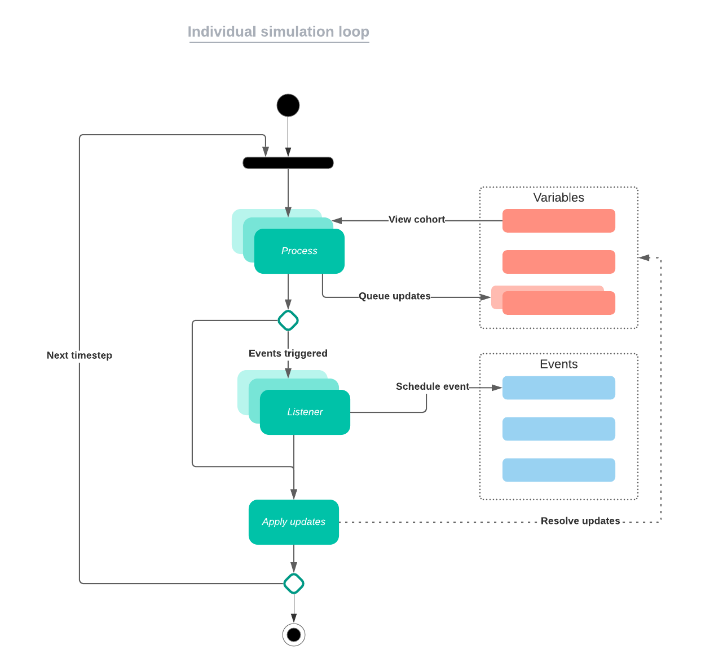

```{r, include = FALSE}
knitr::opts_chunk$set(
  collapse = TRUE,
  comment = "#>"
)
```

```{r setup, echo=FALSE}
library(individual)
```

```{r conditional_block, eval=!pkgdown::in_pkgdown(),echo=F}
knitr::asis_output(
"## Table of Contents {#toc}

  1. [Introduction](#intro)
  2. [Variables](#var)
      1. [Categorical Variables](#cat_var)
      2. [Integer Variables](#int_var)
      3. [Double Variables](#dbl_var)
  3. [Processes](#proc)
      1. [Render](#rend)
  4. [Events](#event)
      1. [Targeted Events](#t_event)
  5. [Simulate](#sim)"
)
```
 
## Introduction {#intro}

This package defines a set of useful primitives for structuring and simulating individual based mechanistic models, with special emphasis on infectious disease modelling. *Structuring* means that the package lets you specify the state space of the model and transition rules for how state changes over time, and *simulating* means that the package defines a principled way to put state and transitions together to update state over a time step. Transitions are any functions that change state, and in "individual" come in two forms: [processes](#proc), which occur each time step and [events](#event), which are scheduled. The simulation updates over a discrete time step of unit length.

This vignette provides a description of the various primitive elements provided by the "individual" package for modelling and explains how they work together. Please see the `vignette("Tutorial")` for a practical example.

## Variables {#var}

In "individual", variables are how one defines state, and represent any attribute of an individual. While many variables will be dynamically updated throughout a simulation, they don't have to be. Specifying a baseline characteristic for each individual that doesn't change over a simulation will still be specified using a variable object.

There are 3 types of variable objects: `individual::CategoricalVariable` for discrete variables taking values in a finite set, `individual::IntegerVariable` for discrete integer variables, and `individual::DoubleVariable` for continuous variables.

### Categorical Variable {#cat_var}

Most epidemiological models will *require* use of categorical variables to define state, for example, the Susceptible, Infectious, and Recovered classes in the classic [SIR model](https://en.wikipedia.org/wiki/Compartmental_models_in_epidemiology#The_SIR_model). In general, for compartmental models, each set of compartments which describes an aspect of an individual should be mapped to a single `individual::CategoricalVariable`. For example, a model which classifies individuals as in an SIR state _and_ in a high or low risk groups could be represented with two categorical variable objects

There can be an unlimited number of categorical variable objects, but every individual can only take on a single value for each of them at any time. The allowable (categorical) state space for each individual is a contingency table where the margins are given by the values for each `individual::CategoricalVariable`.

`individual::CategoricalVariable` objects internally store state as a hash table of category values (with string keys), each of which contains a `individual::Bitset` recording the individuals in that state, making operations on `individual::CategoricalVariable` objects, or chains of operations extremely fast, and therefore should be the preferred variable type for discrete variables. However, cases in which discrete variables have a large number of values or when many values have few or no individuals in that category should use the `individual::IntegerVariable` instead.

### Integer Variable {#int_var}

An `individual::IntegerVariable` should be used for discrete variables that may either be technically unbounded, or whose set of possible values is so large that a `individual::CategoricalVariable` is impractical. `individual::IntegerVariable` objects internally stores state as a vector of integers of length equal to the number of individuals in the simulation, to be contrasted with the hash table and bitsets used in `individual::CategoricalVariable`. Examples of this variable type might include household for a model that simulated transmission of disease between a community of households, or age group for an age-structured model.

### Double Variable {#dbl_var}

A `individual::DoubleVariable` can be used for continuous variables that are represented as double precision floating-point numbers (hence, "double"). Such variables are internally stored as a vector of doubles of length equal to the number of individuals in the simulation. Examples of this variable type might include levels of immune response or concentration of some environmental pollutant in the blood.

## Processes {#proc}

In "individual", processes are functions which are called on each time step with a single argument, `t`, the current time step of the simulation. Processes are how most of the dynamics of a model are specified, and are implemented as [closures](http://adv-r.had.co.nz/Functional-programming.html#closures), which are functions that are able to access data not included in the list of function arguments.

An illustrative example can be found in the provided `individual::bernoulli_process`, which moves individuals from one value (source) of a `individual::CategoricalVariable` to another (destination) at a constant probability (such that the dwell time in the `from` state follows a [geometric distribution](https://en.wikipedia.org/wiki/Geometric_distribution)). 

```{r, eval=FALSE}
bernoulli_process <- function(variable, from, to, rate) {
  function(t) {
    variable$queue_update(
      to,
      variable$get_index_of(from)$sample(rate)
    )
  }
}
```

We can test empirically that dwell times do indeed follow a geometric distribution (and demonstrate uses of `individual::IntegerVariable` objects) by modifying slightly the function to take `int_variable`, an object of class `individual::IntegerVariable`. Each time the returned function closure is called it randomly samples a subset of individuals to move to the destination state, and records the time step at which those individuals move in the `individual::IntegerVariable`. We run the simple simulation loop until there are no more individuals left in the source state, and compare the dwell times in the source state to the results of `stats::rgeom`, and see that they are from the same distribution, using `stats::chisq.test` for comparison of discrete distributions.

```{r}
bernoulli_process_time <- function(variable, int_variable, from, to, rate) {
  function(t) {
    to_move <- variable$get_index_of(from)$sample(rate)
    int_variable$queue_update(values = t, index = to_move)
    variable$queue_update(to, to_move)
  }
}

n <- 5e4
state <- CategoricalVariable$new(c('S', 'I'), rep('S', n))
time <- IntegerVariable$new(initial_values = rep(0, n))

proc <- bernoulli_process_time(variable = state,int_variable = time,from = 'S',to = 'I',rate = 0.1)

t <- 0
while (state$get_size_of('S') > 0) {
  proc(t = t)
  state$.update()
  time$.update()
  t <- t + 1
}

times <- time$get_values()
chisq.test(times, rgeom(n,prob = 0.1),simulate.p.value = T)
```
By using `individual::IntegerVariable` and `individual::DoubleVariable` objects to modify the probability with which individuals move between states, as well as counters for recording previous state transitions and times, complex dynamics can be specified from simple building blocks. Several "prefab" functions are provided to make function closures corresponding to state transition processes common in epidemiological models.

### Render {#rend}

During each time step we often want to record (render) certain output from the simulation. Because rendering output occurs each time step, they are called as other processes during the simulation loop (this is another way we could have implemented the time counters in the previous example).

In "individual", rendering output is handled by `individual::Render` class objects, which build up the recorded data and can return a `base::data.frame` object for plotting and analysis. A `individual::Render` object is then stored in a function closure that is called each time step like other processes, and into which data may be recorded. Please note that the function closure must also store any variable objects whose values should be tracked, such as the prefab rendering process `individual::categorical_count_renderer_process`, taking a `individual::Render` object as the first argument and a `individual::CategoricalVariable` object as the second.

```{r,eval=FALSE}
categorical_count_renderer_process <- function(renderer, variable, categories) {
  function(t) {
    for (c in categories) {
      renderer$render(paste0(c, '_count'), variable$get_size_of(c), t)
    }
  }
}
```

## Events {#event}

While technically nothing more than variables and processes is required to simulate complex models in "individual", keeping track of auxiliary state, such as counters which track the amount of time until something happens (e.g., a non-geometric waiting time distribution) can quickly add unnecessary frustration and complexity. The `individual::Event` class is a way to model events that don't occur every time step, but are instead scheduled to fire at some future time after a delay. The scheduled events can be canceled, if something occurs first that should preempt them.

Events can be scheduled by processes; when an event fires, the event listener is called. The event listener is an arbitrary function that is called with the current time step `t` as its sole argument. Listeners can execute any state changes, and can themselves schedule future events (not necessarily of the same type). Listeners are implemented as function closures, just like [processes](#proc). Events can have any number of listeners attached to them which are called when the event fires.

### Targeted Events {#t_event}

Unlike `individual::Event` objects, whose listeners are called with a single argument `t`, when the listeners of `individual::TargetedEvent` objects are called, two arguments are passed. The first is the current time step `t`, and the second is a `individual::Bitset` object giving the indies of individuals which will be affected by the event. Because it stores these objects internally to schedule future updates, initialization of `individual::TargetedEvent` objects requires the total population size as an argument. When scheduling a `individual::TargetedEvent`, a user provides a vector or `individual::Bitset` of indicies for those individuals which will have the event scheduled. In addition, a user provides a delay which the event will occur after. The delay can either be a single value, so all individuals will experience the event after that delay, or a vector of values equal to the number of individuals who were scheduled. This allows, for example individual heterogeneity in distribution of waiting times for some event.

Much like regular [Events](#event), previously scheduled targeted events can be canceled, requiring either a `individual::Bitset` or vector of indices for individuals whose events should be canceled.

The code to define events is typically quite brief, although typically another process must be defined that queues them. A recovery event in an SIR model for example, might look like this, where `state` is a `individual::CategoricalVariable`:

```{r}
recovery_event <- TargetedEvent$new(population_size = 100)
recovery_event$add_listener(function(timestep, target) {
  state$queue_update('R', target)
})
```

## Simulate {#sim}

Using a combination of [variables](#var), [processes](#proc), and [events](#events), highly complex individual based models can be specified, and simulated with the function `individual::simulation_loop`, which defines the order in which state updates are preformed. 

It is possible to create conflicts between different processes, for example, if a single individual is subject to a death process and infection process, then both death and infection state changes could be scheduled for that individual during a time step. When processes or events create conflicting state updates, the *last* update will take precedence. Another way to make sure conflicts do not exist is to ensure only a single process is called for each state which samples each individual's update among all possible updates which could happen for those individuals, so that conflicting updates cannot be scheduled for individuals in a state.

```{r, echo=FALSE, fig.cap="Simulation loop flowchart", out.width = "100%", fig.align='center'}

```

The equivalent code used in the simulation loop is below.

```{r, class.source="bg-primary", class.output="bg-primary",eval=FALSE}
simulation_loop <- function(
  variables = list(),
  events = list(),
  processes = list(),
  timesteps
  ) {
  if (timesteps <= 0) {
    stop('End timestep must be > 0')
  }
  for (t in seq_len(timesteps)) {
    for (process in processes) {
      execute_any_process(process, t)
    }
    for (event in events) {
      event$.process()
    }
    for (variable in variables) {
      variable$.update()
    }
    for (event in events) {
      event$.tick()
    }
  }
}
```

